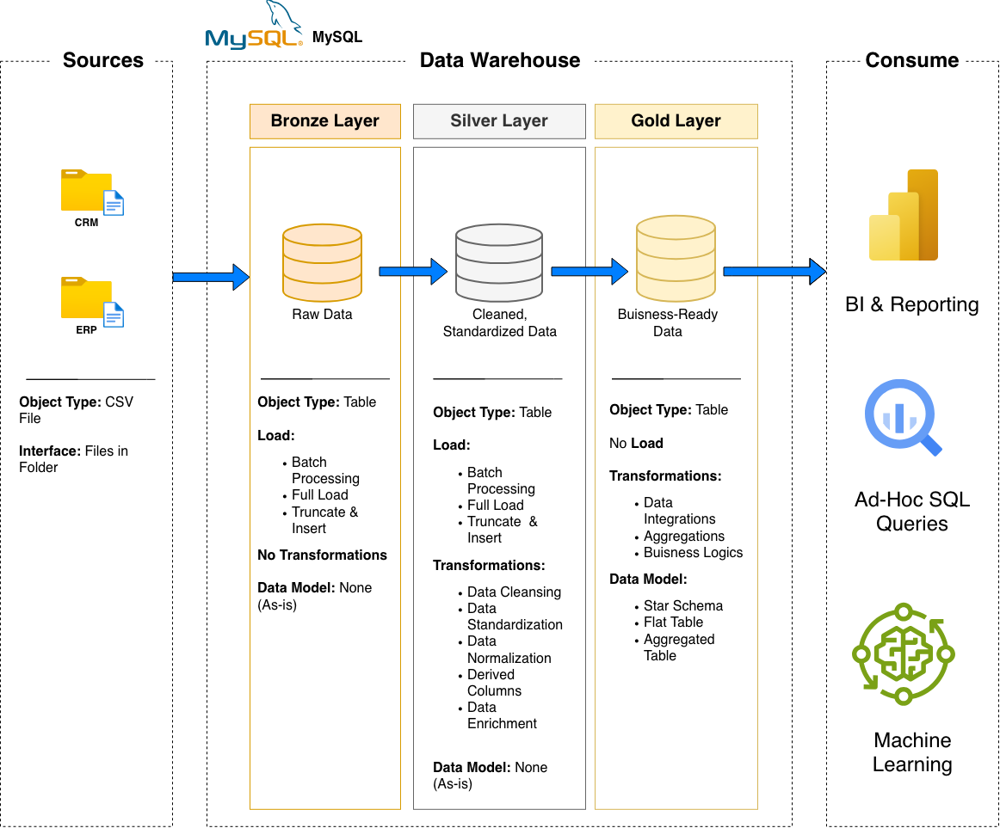

# MySQL Data Warehouse Project

A data warehouse built in MySQL, following a Bronze → Silver → Gold layered architecture. Raw CRM and ERP data (CSV files) is loaded, cleaned, and modeled into a star schema for analytics and reporting.

## Overview

- **Bronze layer**: raw CSV data loaded as-is into MySQL tables, no transformations.
- **Silver layer**: cleaned and standardized data (deduplication, type fixes, derived columns, whitespace/formatting fixes).
- **Gold layer**: business-ready views modeled as a star schema (`dim_customers`, `dim_products`, `fact_sales`) for reporting and ad-hoc queries.

## Project Structure

- `scripts/init_database.sql` — creates the bronze/silver/gold databases
- `scripts/bronze/ddl_bronze.sql` — bronze table definitions
- `scripts/bronze/load_bronze.sql` — loads CSVs into bronze
- `scripts/silver/ddl_silver.sql` — silver table definitions
- `scripts/silver/proc_load_silver.sql` — stored procedure that cleans and loads bronze → silver
- `scripts/silver/quality_checks_silver.sql` — validation checks for silver
- `scripts/gold/ddl_gold.sql` — gold layer views (star schema)
- `scripts/gold/quality_checks_gold.sql` — validation checks for gold
- `datasets/source_crm/` — raw CRM CSV files
- `datasets/source_erp/` — raw ERP CSV files

## How to Run

1. Run `scripts/init_database.sql` to create the databases.
2. Run `scripts/bronze/ddl_bronze.sql`, then `scripts/bronze/load_bronze.sql` (update the file path placeholder to match your local clone location, and enable `local_infile` on both the MySQL server and client).
3. Run `scripts/silver/ddl_silver.sql`, then `scripts/silver/proc_load_silver.sql` to create the stored procedure, then `CALL silver.load_silver();`.
4. Run `scripts/gold/ddl_gold.sql` to create the gold layer views.
5. Run the quality check scripts in `silver/` and `gold/` to validate the data.
